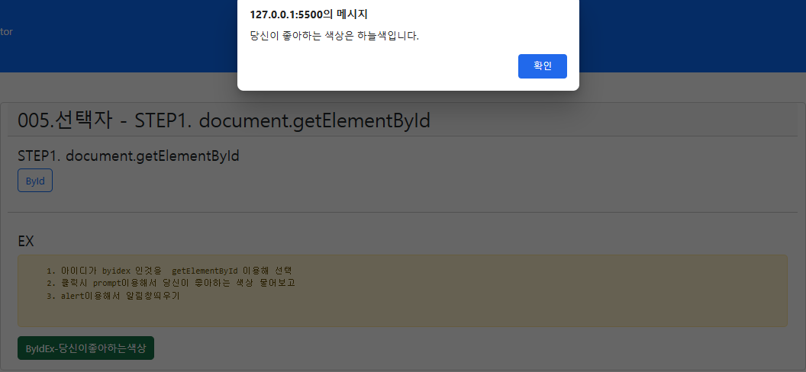
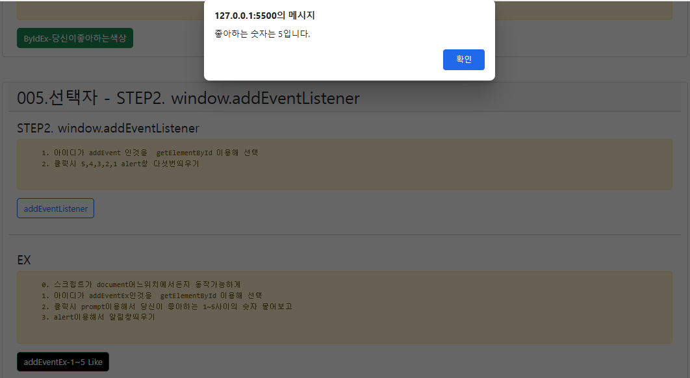

# ■JAVA

# ■WEB
```html
<div class="container card  my-5">
  <h2  class="card-header">005.선택자 - STEP1. document.getElementById</h2>
  <div class="card-body">
    <h4  id="step1">STEP1. document.getElementById</h4>
    <input type="button" value="ById" 
       id="byid" title="버튼을 클릭하세요.(js)" 
       class="btn btn-outline-primary"      />
    <script>
      //      이벤트대상                  이벤트      = 이벤트핸들러
      document.getElementById("byid").onclick = function(){ 
        alert("hoho");
      };
      // step1을 클릭하면 본인이름 알림창띄우기  
      document.getElementById("step1").style.cursor = "pointer";
      document.getElementById("step1").onclick = function(){
        alert("홍길동");
      };
    </script>
  </div>
  <!--     -->
  <!--     -->
  <hr/>
  <div class="card-body">
    <h4>EX</h4>
    <pre class="alert alert-warning">
    1. 아이디가 byidex 인것을  getElementById 이용해 선택
    2. 클릭시 prompt이용해서 당신이 좋아하는 색상 물어보고
    3. alert이용해서 알림창띄우기 
    </pre>    
    <input type="button"  value="ByIdEx-당신이좋아하는색상"  
       title="버튼4"  id="byidex"   class="btn btn-success" />
    <script>
    document.getElementById("byidex").onclick = function(){
      let color = prompt("당신이 좋아하는 색상은? ");
      alert("당신이 좋아하는 색상은 " + color + "입니다.");
    }; 
    </script>
  </div>
</div>
```

```html
<div class="container card  my-5">
  <h2  class="card-header">005.선택자 - STEP2. window.addEventListener</h2>
  <div class="card-body">
    <h4>STEP2. window.addEventListener</h4>
    <pre class="alert alert-warning">
    1. 아이디가 addEvent 인것을  getElementById 이용해 선택
    2. 클릭시 5,4,3,2,1 alert창 다섯번띄우기
    </pre>     
    <input type="button"  value="addEventListener" 
     title="버튼4"  id="addEvent"    class="btn btn-outline-primary"    />

  </div>
  <!--     -->
  <!--     -->
  <hr/>
  <div class="card-body">
    <h4>EX</h4>
    <pre class="alert alert-warning">
    0. 스크립트가 document어느위치에서든지 동작가능하게
    1. 아이디가 addEventEx인것을  getElementById 이용해 선택
    2. 클릭시 prompt이용해서 당신이 좋아하는 1~5사이의 숫자 물어보고
    3. alert이용해서 알림창띄우기 
    </pre>        
    <input type="button"  value="addEventEx-1~5 Like"  
           title="버튼5"  id="addEventEx"  class="btn btn-success" />
    <script>
     window.addEventListener("load" , function(){
        let target=document.getElementById("addEventEx");
        target.onclick=function(){
          let like = prompt("좋아하는 숫자1~5" , "1~5");
          alert("좋아하는 숫자는 " + like + "입니다.");
          target.style.backgroundColor="#000";
          target.style.color="#fff";
        };
     });   

    </script>
  </div>
</div>
```
