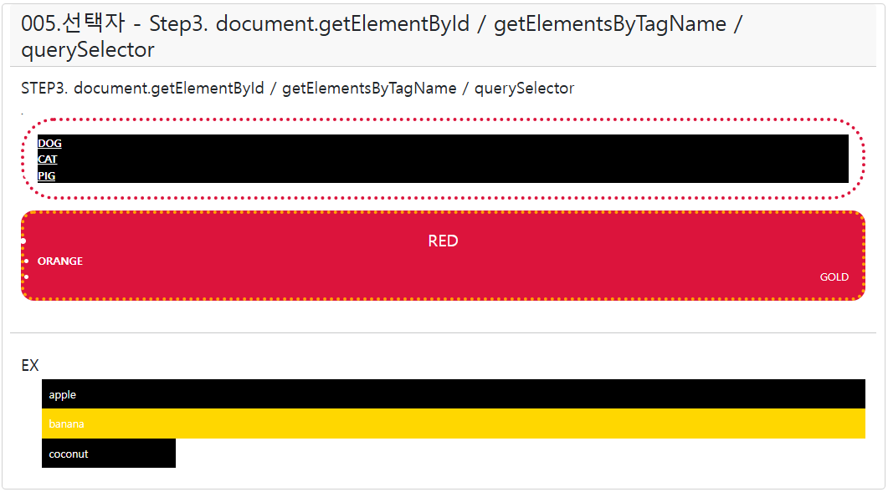
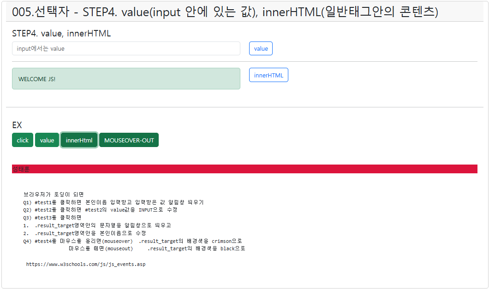

# ■JAVA
### ■ Java 복습문제

Q1. static 키워드의 특징을 설명하고 빈칸을 채우시오. 
static은 클래스에 (① 선언)되어 공유된다. 
객체 생성 없이 (② 클래스) 이름으로 접근 가능하다. 
메모리 영역은 (③ method) area에 저장된다.

Q2. final 키워드의 역할을 설명하고 빈칸을 채우시오. 
final로 선언된 변수는 (④ 재할당)할 수 없다. 
final 메서드는 (⑤ 오버라이딩)할 수 없다. 
final 클래스는 (⑥ 상속)될 수 없다.

Q3. modifier(접근제어자)의 종류와 역할을 설명하고 빈칸을 채우시오. 
public은 (⑦ 모든 클래스) 접근 가능하다. 
private은 (⑧ 클래스 내부) 내에서만 접근 가능하다. 
protected는 (⑨ 같은 패키지) 및 상속 관계에서 접근 가능하다.

Q4. static과 instance의 차이를 설명하고 빈칸을 채우시오. 
static은 클래스에 (⑩ 선언)되고, 
instance는 객체에 (⑪ 포함)된다. 
static 변수는 모든 객체가 (⑫ 공유)하고, 
instance 변수는 객체마다 (⑬ 다르게 설정)된다.

Q5. 다음 코드에서 static, final, modifier 관련 빈칸을 채우시오.
```java
class Car {
    static String brand = "Hyundai";  //   클래스변수 - method area - new X - 생성자 X
    final int wheels = 4;   // 상수 - method area - 변경 x
    private String model;  

    public Car(String model) {
        this.model = model;
    }

    public void show() {  // 인스턴스변수
        System.out.println("Brand: " + brand);
        System.out.println("Model: " + this.model);
        System.out.println("Wheels: " + wheels);
    }
}
```

brand는 모든 객체가 (⑭ 공유)하는 클래스 변수이다. 
wheels는 (⑮ 변경)할 수 없는 상수이다. 
model은 외부에서 직접 접근할 수 없도록 (⑯ private) 제어자가 붙어 있다. 
Car 클래스의 생성자는 객체 생성 시 (⑰ model)을 초기화한다. 
show() 메서드는 객체의 (⑱ 상태)를 출력한다.

# ■WEB
```html
<div class="container card  my-5">
  <h2  class="card-header">005.선택자 - Step3. document.getElementById / getElementsByTagName / querySelector  </h2>
  <div class="card-body">
    <h4>STEP3. document.getElementById / getElementsByTagName / querySelector</h4> .
    <ul id="animal">
      <li>DOG</li>
      <li id="cat">CAT</li>
      <li id="pig">PIG</li>
    </ul>
    <script>
      window.addEventListener("load", function(){ 
        //1. step1 #animal 선택하기             
        let animal=document.getElementById("animal");
        console.log(animal);
        //2. 그 안에 동물들(li) 찾기
        let anis = animal.getElementsByTagName("li");
        console.log(anis);

        //3. 꾸미기 
        //anis.style.color="#f00"; 
        anis[0].style.color="blue"
        anis[1].style.color="#f00"
      });
    </script>
    <script>
      window.addEventListener("load",function(){
        //4. 만능 querySelector (#animal)
        let animal2 = document.querySelector("#animal");
        console.log(animal2);
        animal2.style.border="5px dotted crimson";
        animal2.style.padding="20px";
        animal2.style.borderRadius="50px";
        //5. 만능 모든요소가져오기 querySelectorAll
        let alis = document.querySelectorAll("#animal li");
        for(let i=0;i<alis.length;i++){
          alis[i].style.fontWeight="bold";
          alis[i].style.textDecoration="underline";
          alis[i].style.backgroundColor="black"
          alis[i].style.color="white"
        }
      });
  
 
    </script>

    <ul id="color">
      <li>RED</li>
      <li id="orange">ORANGE</li>
      <li id="gold">GOLD</li>
    </ul>
    <script>
      //Q1. #color 선택하기 color라는 변수에 담기
      //Q2. 안에 있는 li태그들 선택
      //Q3. 첫번째 RED의 글자사이즈 25px
      window.addEventListener("load", function(){ 
        let color=document.getElementById("color");
        let lis = color.getElementsByTagName("li");
        lis[0].style.fontSize="25px";
        lis[1].style.fontWeight="bold";
      });


      
      window.addEventListener("load",function(){
        let color2=document.querySelector("#color");
        color2.style.backgroundColor="crimson";
        color2.style.color="white";
      })
        
       /*
      window.addEventListener("load", function(){
        let color2=document.querySelectorAll("#color li");
        for(let i=0;i<color2.length;i++){
          color2[i].style.backgroundColor="crimson";
          color2[i].style.color="white";
        }
      });
      */
      // 6~9
      window.addEventListener("load",function(){
        // 6. querySelector / querySelectorAll 이용하기
        let cs = document.querySelector("#color");
        let children = cs.children;
        console.log(children);
        //7. parentElement
        let child = document.querySelector("#orange");
        orange.parentElement.style.border="5px dotted orange";
        orange.parentElement.style.borderRadius="20px"
        //8. 제일가까운 상위부모    
        orange.closest("ul").style.padding="20px";
        //9. 형제요소 
        orange.previousElementSibling.style.textAlign="center";
        orange.nextElementSibling.style.textAlign="right";
      })
      
    </script>
  </div>
  <!--     -->
  <!--     -->
  <hr/>
  <div class="card-body">
    <h4>EX </h4>
    <ul id="fruits">
      <li>apple</li>
      <li id="banana">banana</li>
      <li id="coconut">coconut</li>
    </ul>
    <script>
      window.addEventListener("load",function(){
        //Q1) document.getElementsById 이용해서  #fruits 선택  
        let fr = document.getElementById("fruits");
        //Q2) document.getElementsByTagName 이용해서  
        //   #fruits 안의 모든 li에 배경색 black, 글자색 white , 여백 10px주기
        let a = fr.getElementsByTagName("li");
        for(let i=0;i<a.length;i++){
          a[i].style.backgroundColor="black";
          a[i].style.color="white";
          a[i].style.padding="10px";
        }
        
        //Q2) document.getElementsById 이용해서 banana 선택 배경색 gold
        let b = document.getElementById("banana");
        b.style.backgroundColor="gold"

        //Q3) document.querySelector 이용해서 coconut 선택 
        //  coconut를 클릭하면 width:200px; 로 수정
        //document.querySelector("#coconut").style.width="200px";
        document.querySelector("#coconut").onclick=function(){
          //document.querySelector("#coconut").style.width="200px";
          this.style.width="200px";  //this 내가 선택한 이벤트 대상
        };
      });
    </script>
  </div>
</div>
```

```html
<div class="container card  my-3">
  <h2  class="card-header">005.선택자 - STEP4. value(input 안에 있는 값), innerHTML(일반태그안의 콘텐츠) </h2>
  <div class="card-body">
    <h4>STEP4. value, innerHTML </h4>
    <div class="row">
      <div class="col"><input type="text"    id="value_target"  class="form-control"
                         placeholder="input에서는 value"  /></div>
      <div class="col"><input type="button"  value="value"  title="value_target"  id="value"  class="btn btn-outline-primary" /></div>
    </div>
    <hr/>
    <div class="row">
      <div class="col"> <div class="inner_target  alert alert-success"></div>  </div>
      <div class="col"><input type="button"  value="innerHTML"  title="value_target"  id="inner"   class="btn btn-outline-primary" /></div>
    </div>

    <script>
      window.addEventListener("load", function(){
        let value = document.querySelector("#value");
        value.addEventListener("click", function(){
          let value_target = document.querySelector("#value_target");
          alert(value_target.value); // input 대상의.value
          value_target.value="";
        });
      
        let inner = document.querySelector("#inner");
        inner.addEventListener("click", function(){
          let inner_target = document.querySelector(".inner_target");
          inner_target.innerHTML="WELCOME JS!";
        });
      });
    </script>
  </div>
  <!--     -->
  <!--     -->
  <hr/>
  <div class="card-body" id="id">
    <h4>EX</h4>
    <input type="button"  value="click"         id="test1"    class="btn btn-success"   />
    <input type="button"  value="value"         id="test2"    class="btn btn-success"   />
    <input type="button"  value="innerHtml"     id="test3"    class="btn btn-success"   />
    <input type="button"  value="MOUSEOVER-OUT" id="test4"    class="btn btn-success"   />
    <div class="result_target  my-5">JAVASCRIPT</div>

    <pre>
    브라우저가 로딩이 되면
    Q1) #test1를 클릭하면 본인이름 입력받고 입력받은 값 알림창 띄우기
    Q2) #test2를 클릭하면 #test2의 value값을 INPUT으로 수정
    Q3) #test3를 클릭하면
    1.  .result_target영역안의 문자열을 알림창으로 띄우고
    2.  .result_target영역안을 본인이름으로 수정
    Q4) #test4를 마우스를 올리면(mouseover)  .result_target의 배경색을 crimson으로
                    마우스를 떼면(mouseout)     .result_target의 배경색을 black으로

     https://www.w3schools.com/js/js_events.asp
    </pre>
    <script>
      let name;

      window.addEventListener("load", function(){
        let a = document.querySelector("#test1");
        a.addEventListener("click", function(){
          name = prompt("본인의 이름을 입력하세요","ex) 홍길동");
          alert(name);
        });

        let b = document.querySelector("#test2");
        b.addEventListener("click", function(){
          let b_target = document.querySelector("#test2");
          this.value="INPUT";
        });

        let c = document.querySelector("#test3");
        c.addEventListener("click", function(){
          let c_target = document.querySelector(".result_target");
          alert(c_target.innerHTML);
          c_target.innerHTML = name;
        });

        let d = document.querySelector("#test4");
        d.addEventListener("mouseover", function(){
          let d_target = document.querySelector(".result_target").style.backgroundColor="crimson";
          d.addEventListener("mouseout", function(){
            document.querySelector(".result_target").style.backgroundColor="black";
          });
        });
      });
    </script>
  </div>
</div>
```
